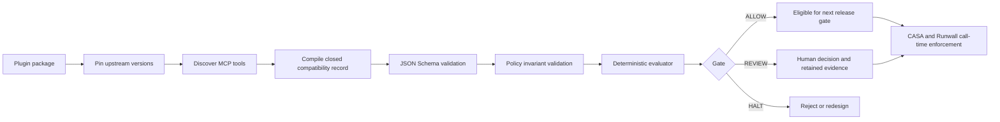

# Agent Plugins 1.0 + MCP Governance Compatibility Pack

## Decision and status

This repository defines version `1.0.0` of a reusable conformance and release profile for Agent Plugin packages backed by Model Context Protocol servers.

`Agent Plugins 1.0` is the Toolkit's profile name and semantic version. It is **not** represented as an OpenAI protocol-version claim. The reviewed OpenAI documentation defines versioned plugin manifests and a plugin package model, but it does not identify a public upstream specification named “Agent Plugins 1.0.” The upstream inputs are therefore pinned independently:

- OpenAI Agent Plugins documentation snapshot: `2026-08-23`
- MCP protocol specification: `2026-07-28`

Changing either upstream pin requires a reviewed compatibility-profile revision and new regression evidence. A record cannot silently substitute another MCP version or a later documentation snapshot.

## Mission, users, and outcome

### Mission

Make an Agent Plugin package eligible for controlled installation or release only when its package boundary, MCP server, discovered tools, permissions, side effects, data handling, and verification evidence are explicit and mutually consistent.

### Primary users

- Plugin authors preparing a package for ChatGPT or Codex.
- Platform and security teams reviewing MCP servers and tools.
- CASA and Runwall implementers translating declared authority into call-time enforcement.
- Operator Intelligence evaluators making release decisions.
- Maintainers of reusable Team Packs or Cognitive Persona Architecture assets that may later be distributed through plugin Skills and MCP tools.

### Intended outcome

A consumer submits one closed compatibility record. The schema rejects undocumented structure; the evaluator returns a deterministic `ALLOW`, `REVIEW`, or `HALT` decision with stable finding codes; the complete record and decision can be retained as a release receipt.

## Scope

The pack governs:

1. Plugin identity, version, purpose, required manifest location, and component paths.
2. Agent Plugins documentation and MCP protocol version pins.
3. Remote Streamable HTTP and local stdio server boundaries.
4. Authentication mode, token audience, per-call scope enforcement, rate limiting, timeouts, validation, sanitization, and egress.
5. Discovered tool names, descriptions, input/output schemas, annotations, operations, authority, reversibility, idempotency, approval, and audit behavior.
6. Least privilege, consent, logging, retention, deletion, structured-result validation, and inventory integrity.
7. Evidence digests, source references, tests, declared decision, and declared-versus-computed gate coherence.

## Non-goals and boundaries

This pack does not:

- implement an MCP client or server;
- install, enable, publish, merge, or deploy a plugin;
- prove that an asserted digest, identity, OAuth scope, endpoint, or test result is authentic;
- replace OpenAI plugin review or workspace administration;
- replace MCP transport authorization;
- grant authority to a model, tool description, plugin manifest, repository file, or discovered server;
- define Cognitive Persona Architecture psychology, Team Pack role behavior, or subagent orchestration topology;
- make a one-time release decision sufficient for every future tool invocation.

The compatibility record is design-time and release-time evidence. CASA or an equivalent authority layer must decide whether a requested action is authorized. Runwall or an equivalent runtime boundary must enforce that decision for each invocation. A tool remains untrusted input until server identity and discovery evidence are verified.

## Upstream compatibility model

The profile maps two upstream layers and adds a governance layer that neither layer can provide alone.

| Layer | Upstream primitive | What this pack verifies |
|---|---|---|
| Package | `.codex-plugin/plugin.json`, Skills, `.mcp.json`, `.app.json`, hooks, assets | Stable identity, version, purpose, root-contained paths, declared components, hook review |
| Protocol | MCP JSON-RPC, discovery, tools, schemas, results, transport, authorization | Exact protocol pin, transport, tool inventory, schema and auth boundaries |
| Tool semantics | Names, descriptions, input/output schemas, annotations | Annotation/behavior coherence, minimal inputs, structured outputs, visible side effects |
| Authority | Host approvals and implementation-specific policy | Explicit operation-to-authority mapping, authorized scope, call-time approval mode |
| Release | Tests and retained artifacts | Source pins, digests, adversarial cases, declared/computed decision coherence |

OpenAI's package documentation requires `.codex-plugin/plugin.json`; component paths are relative to the plugin root; plugin packages may contain Skills, MCP server mappings/configuration, hooks, and assets. Plugin-scoped MCP configuration can restrict enabled tools and set default or per-tool approval modes. Bundled hooks are not automatically trusted.

MCP defines the wire and capability model. It does not make a discovered tool safe merely because it is protocol-valid. The MCP specification explicitly treats tool annotations as untrusted unless they come from a trusted server, requires servers to validate inputs, enforce access control, rate limit calls, and sanitize outputs, and recommends client confirmation, result validation, timeouts, and audit logs.

## Components and source of truth

| Artifact | Authority |
|---|---|
| `governance/agent-plugins-mcp-compatibility.md` | Human-readable system contract and threat model |
| `policies/agent-plugin-mcp-governance.json` | Canonical, non-tunable compatibility invariants |
| `schemas/agent-plugin-mcp-compatibility.schema.json` | Closed compatibility-record interface |
| `evaluators/agent-plugin-mcp-compatibility.js` | Deterministic gate computation and finding codes |
| `examples/agent-plugin-mcp-compatibility/read-only-governance-catalog.json` | Smallest complete `ALLOW` proof |
| `fixtures/agent-plugin-mcp-compatibility/regression-cases.json` | Positive, review, halt, schema-invalid, and downgrade-resistance proof |
| `run-regression.js` | Repository-native conformance entrypoint |

The JSON policy is the machine-readable semantic authority. The evaluator validates policy invariants before evaluating a record; a weakened or drifted canonical policy fails closed to `HALT`.

## Compatibility-record interface

### Identity and upstream pins

The record identifies the Toolkit profile version and separately records:

- the Toolkit-defined Agent Plugins profile label;
- the date of the OpenAI documentation snapshot;
- the official OpenAI source URL;
- the exact MCP protocol version;
- the official MCP specification URL.

A mismatch is `HALT`, not a best-effort downgrade. Compatibility with a new upstream version must be demonstrated in a new profile revision.

### Package boundary

The required manifest location is `.codex-plugin/plugin.json`. Every referenced component path must:

- start with `./`;
- remain inside the plugin root;
- avoid `..` traversal;
- be declared in the compatibility record.

A package with discovered tools must declare an MCP server component. Hook inclusion routes the package to `REVIEW` because installation or enablement does not itself establish trust in the current hook definition.

### Server boundary

Remote MCP servers require HTTPS Streamable HTTP. Local stdio servers route to `REVIEW` because starting a local command crosses execution, filesystem, and often network boundaries.

The record must declare:

- authentication mode (`none`, `oauth_2_1`, or `environment`);
- requested scopes;
- per-call scope enforcement;
- token-audience validation;
- token-passthrough status;
- input validation, output sanitization, rate limiting, timeout, and egress allowlist.

OAuth-protected servers require at least one minimal scope, per-call scope enforcement, and audience validation. Token passthrough is prohibited. Environment credentials are limited to stdio in this profile. Unauthenticated servers are limited to public, read-only capabilities.

### Tool contract

Each discovered tool must have a unique name and declare:

- a truthful, bounded description;
- an object-shaped input schema;
- a typed output schema or an explicit missing value;
- `readOnlyHint`, `destructiveHint`, and `openWorldHint`;
- operation and external-effect class;
- whether all side effects are visible;
- reversibility and retry behavior;
- data sensitivity and required authority;
- authorized scope, approval mode, audit logging, confirmation, and default-enabled state.

This profile requires all three annotation fields even though MCP makes the annotations object optional. The stricter requirement exists because OpenAI's plugin guidelines require correct action labeling and because omitted booleans are ambiguous at the release boundary.

Tool annotations do not grant authority. The evaluator checks their consistency against the separately declared behavior:

- `read` and `search` require `readOnlyHint: true`;
- non-read operations require `readOnlyHint: false`;
- destructive operations require `destructiveHint: true`;
- external effects require `openWorldHint: true`;
- operation and required authority must match the canonical mapping.

### Canonical operation-to-authority mapping

| Operation | Required authority | Minimum profile posture |
|---|---|---|
| `read` | `read` | May reach `ALLOW` when public, bounded, typed, and audited |
| `search` | `search` | May reach `ALLOW` when public, bounded, typed, and audited |
| `create`, `update`, `delete` | `edit` | `REVIEW`; unsafe auto-approval is `HALT` |
| `send`, `publish` | `network` | `REVIEW`; explicit destination and user confirmation required |
| `execute` | `execute` | `REVIEW`; unsafe auto-approval is `HALT` |
| `permission_change` | `permission` | `HALT` for automated authority in profile 1.0 |
| `financial_transaction` | `credential` | `HALT` for automated authority in profile 1.0 |

This mapping is deliberately non-transitive. Read does not imply search, search does not imply network, edit does not imply publish, and credential possession does not imply a financial-action grant.

### Minimal-input and credential boundary

The input schema must reject undocumented top-level properties with `additionalProperties: false`; leaving the schema open routes to `REVIEW`.

The profile prohibits fields that request broad chat history or credentials, including full-conversation/transcript/history fields, access or refresh tokens, API keys, passwords, and secrets. This is an exact denylist, not permission to collect every field absent from it. Every allowed field must still be necessary for the stated tool purpose.

Sensitive values must not use MCP's `x-mcp-header` extension. Header mirroring can expose values to network intermediaries and is not a credential transport.

### Results and state

Every tool should define `outputSchema`; absence routes to `REVIEW`. When an output schema exists, the implementation must validate structured results before downstream use. A result is data, not authority, and cannot change its own gate.

State handles are identifiers, not capabilities. A runtime implementing stateful tools must re-check authorization on every use, keep handles opaque, bound their lifetime, and return explicit expiry errors. These runtime properties remain integration requirements because the current record does not model individual state handles.

## Deterministic flow



The evaluator never installs or invokes the plugin. `ALLOW` means that the compatibility record is eligible for the next release gate; it is not permission to merge, publish, deploy, or execute a tool.

## Gate semantics

### `ALLOW`

`ALLOW` is possible only for the narrow reference posture represented by the completed example:

- exact profile and upstream pins;
- valid package and root-contained paths;
- no hooks;
- HTTPS remote server or another non-local-execution path;
- public, authenticated-as-needed, read-only tools;
- closed inputs and typed outputs;
- truthful annotations and authority mapping;
- validation, sanitization, rate limit, timeout, consent, least privilege, audit, privacy, retention, and inventory evidence;
- no unresolved finding at `REVIEW` or `HALT`.

### `REVIEW`

`REVIEW` preserves a usable but consequential or incompletely evidenced design. Examples include:

- any write, execute, destructive, or open-world tool with safe call-time prompting;
- plugin hooks;
- local stdio execution;
- missing output schema;
- open input schemas;
- missing audit, structured-result, privacy, retention, or correlation controls;
- official-source evidence gaps;
- retry behavior that can repeat write effects.

A reviewer may approve a bounded release after resolving or explicitly accepting the finding. The runtime must still prompt or deny according to the tool policy.

### `HALT`

`HALT` rejects the profile until it is redesigned or corrected. Examples include:

- profile or MCP version drift;
- invalid manifest location or plugin-root path traversal;
- missing MCP component for a tool-bearing record;
- non-HTTPS remote transport;
- missing server validation, output sanitization, or rate limit;
- token passthrough or incomplete OAuth scope/audience controls;
- duplicate tools;
- broad transcript/history or credential input fields;
- sensitive `x-mcp-header` use;
- annotations that contradict behavior;
- hidden side effects;
- wrong or unauthorized authority scope;
- automated permission changes or financial transactions;
- auto-approved consequential tools;
- irreversible operations without confirmation;
- sensitive or consequential unauthenticated servers;
- missing enforced egress boundary;
- missing consent, least-privilege, inventory, or deletion controls;
- attempted weakening of canonical policy invariants.

The highest finding wins. A model, tool result, manifest, or declared gate cannot downgrade `REVIEW` or `HALT`.

## Permissions and runtime integration

The compatibility record supplies declared facts to enforcement; it does not enforce them.

| Toolkit component | Responsibility |
|---|---|
| CASA | Resolve operator authority, purpose, actor, target, scope, and required human gate |
| Runwall | Enforce enabled tools, per-call approval, arguments, destinations, timeouts, and denial |
| DiffWall | Evaluate package, policy, schema, evaluator, workflow, or dependency changes before merge |
| Mirdexx/shared ledger | Retain discovery snapshot, digests, test evidence, decision, call receipts, and exceptions |
| Operator Intelligence | Evaluate quality, calibration, regression evidence, and release readiness |
| Cognitive Persona Architecture / Team Packs | Define role and team behavior consumed by Skills or tools; never expand authority declared here |

At call time the runtime should retain at least:

- plugin and server identity;
- tool name and discovery-snapshot digest;
- actor and authenticated subject;
- requested operation, authority, target, and destination;
- arguments after secret redaction;
- approval requirement and decision;
- start/end timestamps, timeout, result class, and error class;
- output-schema validation result;
- correlation ID and durable decision reference.

## Threat model and failure behavior

| Threat or failure | Required behavior |
|---|---|
| Malicious tool description or annotation | Treat as untrusted; compare with governed behavior and verified server identity |
| Prompt injection requests more context or authority | Reject broad/secret fields; scope and authority remain external to content |
| Tool discovery changes after review | Inventory digest mismatch invalidates the prior receipt and requires re-evaluation |
| Confused-deputy authorization | Validate audience, scopes, subject, redirect/discovery metadata, and target resource |
| Token passthrough | `HALT`; obtain a token intended for the MCP resource instead |
| SSRF through discovery, endpoint, or redirect | Enforce HTTPS, destination allowlists, safe discovery, redirect limits, DNS/IP checks, and egress policy at runtime |
| Local stdio package executes arbitrary command | `REVIEW`; show the exact command, sandbox it, and restrict filesystem/network access |
| Hidden external send or publish | `HALT`; correct the description, annotations, operation, destination, and confirmation path |
| Retried mutation duplicates effects | Require idempotency key or explicit repeated-effect confirmation; otherwise `REVIEW` |
| Output schema or result mismatch | Fail the call closed, retain the error, and do not pass invalid structured data downstream |
| State handle guessed or stolen | Treat handle as an identifier, re-authorize every call, use opacity and bounded lifetime |
| Missing audit evidence | `REVIEW`; do not claim governed completion |
| Policy weakening | Canonical-policy validation returns `HALT` before record evaluation |

The runtime should return actionable tool execution errors for correctable business or input failures and protocol errors for malformed/unknown calls. Silent fallback, default allow, and fabricated success are prohibited.

## Logging, privacy, and retention

Auditability does not authorize indiscriminate logging. The default record keeps correlation and decision metadata while excluding raw prompts, secrets, tokens, and unnecessary personal data.

The release record must state whether user data is persisted. Persisted user data requires a deletion path. Retention must be documented, PII must be redacted from logs, and raw-prompt logging routes to `REVIEW` even when a business justification may later exist.

## Rollout and rollback

### Rollout

1. Create a compatibility record from the exact plugin commit and MCP discovery snapshot.
2. Validate the record against the closed schema.
3. Run the deterministic evaluator and full repository regression suite.
4. Retain digests and source/test evidence.
5. For `REVIEW`, obtain and record the required human decision.
6. Configure enabled tools and per-tool approval policy in the host/runtime.
7. Test normal, denied, malformed, injection, retry, timeout, auth-expiry, output-mismatch, and discovery-drift paths.
8. Release only through the repository's normal change, DiffWall, and promotion gates.

### Rollback

The first rollback action is disablement, not mutation of the compatibility receipt:

1. Disable the plugin or affected MCP server/tool.
2. Revoke or narrow scopes and tokens when exposure is possible.
3. Preserve call and decision evidence.
4. Restore the last verified plugin commit and discovery snapshot.
5. Re-run the pack before re-enablement.

A historical receipt remains immutable. A corrected package receives a new digest and decision record.

## Verification and definition of done

Run all repository checks:

```sh
npm ci
npm test
```

Run the completed proof directly:

```sh
node evaluators/agent-plugin-mcp-compatibility.js \
  policies/agent-plugin-mcp-governance.json \
  examples/agent-plugin-mcp-compatibility/read-only-governance-catalog.json
```

Profile 1.0 is definition-of-done eligible only when:

- all JSON parses and every schema compiles;
- the completed example is schema-valid and evaluates `PASS / ALLOW`;
- the canonical-policy invariants cannot be weakened without failure;
- regression fixtures cover valid read-only, governed write, schema-invalid annotation, annotation contradiction, broad context, token passthrough, hidden effect, protocol drift, path traversal, hooks, missing output schema, stdio, sensitive header, irreversible deletion, unauthenticated sensitive access, and declared-gate downgrade;
- the full repository suite passes from a clean dependency install;
- `git diff --check` passes;
- exact branch, commit, test, DiffWall, CI, and approval evidence is retained before promotion.

## Known limitations and next tests

- The record is caller-supplied; digest, server identity, OAuth subject, scope, and test evidence need authenticated collection in a runtime integration.
- Input-field denial is deterministic but cannot prove semantic minimality. Human review and purpose-specific tests remain necessary.
- The evaluator checks the recorded discovery inventory, not a live MCP handshake. A future adapter should fetch `tools/list`, compile every input/output schema, and compare the canonical digest.
- MCP extensions such as Tasks, Skills over MCP, and MCP Apps are not separately modeled in profile 1.0. Each extension is opt-in and should be added only with negotiated-capability and adversarial evidence.
- UI content-security policy, component resources, and plugin public-submission requirements remain outside this minimal headless proof.
- Call-level receipts and revocation behavior are specified but not emitted by this repository.

The next highest-value proof is a discovery adapter that produces this closed record from an exact plugin commit and authenticated `tools/list` response without letting server-supplied metadata grant authority.

## Authoritative source register

Retrieved and reviewed on `2026-08-23`:

- OpenAI, Plugin architecture: <https://developers.openai.com/plugins/concepts/plugins>
- OpenAI, MCP server concept: <https://developers.openai.com/plugins/concepts/mcp-server>
- OpenAI, Package your plugin: <https://developers.openai.com/plugins/build/plugins>
- OpenAI, Plugin guidelines: <https://developers.openai.com/plugins/app-guidelines>
- OpenAI, Security & Privacy: <https://developers.openai.com/plugins/guides/security-privacy>
- OpenAI, MCP server review requirements: <https://developers.openai.com/plugins/deploy/app-review>
- Model Context Protocol, specification `2026-07-28`: <https://modelcontextprotocol.io/specification/2026-07-28>
- Model Context Protocol, tools: <https://modelcontextprotocol.io/specification/2026-07-28/server/tools>
- Model Context Protocol, authorization: <https://modelcontextprotocol.io/specification/2026-07-28/basic/authorization>
- Model Context Protocol, security best practices: <https://modelcontextprotocol.io/docs/2026-07-28/tutorials/security/security_best_practices>
